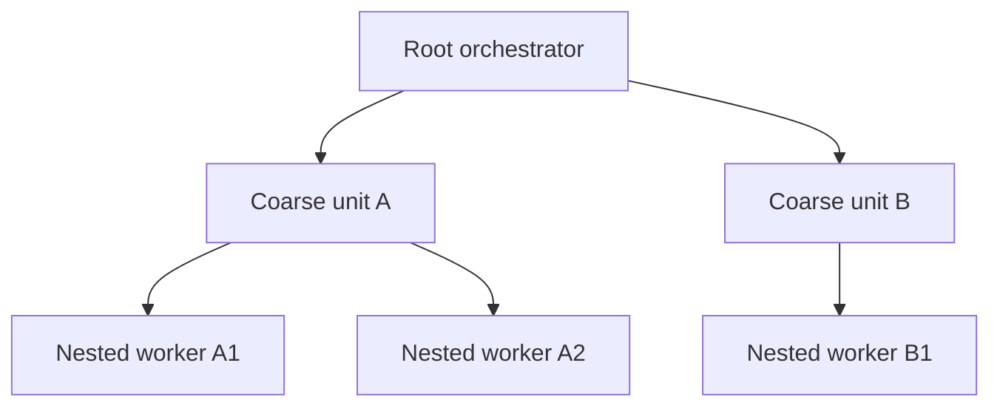

# choco-pi Dynamic Recursive Implementation

Use this workflow only when the user explicitly invokes `/task-dynamic` or names `task-dynamic`; never select it through automatic workflow routing. That invocation is the user's request for nested workers under the system rule that workers otherwise stay leaves. The regular `task` skill remains the default parallel workflow.

## 1. Bootstrap

Follow the `task` skill's bootstrap, including `task-core`, `check`, path-scoped instructions, `review_base`, the mutation lease through the same resolved script, and the acceptance ledger. The sections below define only this workflow's planning and execution deltas.

Explicit invocation authorizes the orchestrator to set `maxSubagentDepth` to the accepted plan's required depth, up to the existing cap of `16`. Each task packet must authorize any child that may spawn the next planned level. Do not increase concurrency or widen the planned depth without separate user authority; runtime limits are session-scoped.

## 2. Decompose recursively

The orchestrator splits the objective into coarse units with exclusive direct and indirect write scopes. Any parent may recursively partition only its own scope among children; scopes narrow down the tree, preserving disjointness by construction. Each parent integrates and verifies its children's actual work before reporting up; a child report is not proof.

Choose roles by unit semantics, using `.pi/model-guidance.md` resolved relative to the repository for justified overrides. Every parent uses the `task` skill's delegation packet, narrowed to the scope it owns. Before any authorized reviewer handoff, the packet requires a scope-owning child to locate the `review` skill's actual `SKILL.md` from available skill metadata or Pi's configured skill directories, inspecting only the `skills` configuration field if needed, then read `references/review-bundle.md` relative to that file. Conventional paths are candidates only. Name every spawned child by its goal (`role-goal`, one to three dashed words, unique among its siblings). Spawned children of a worker are that worker's responsibility; standard `Agent`, `steer_subagent`, `get_subagent_result`, and `stop_subagent` tools remain available.

### Scoped reviewer grandchildren

A scope-owning `implementer` or `general` worker may spawn one bounded `reviewer` child after its implementation unit reaches a reviewable state, but only when the root task packet explicitly authorizes that review and fresh context materially helps. Do not add reviewer grandchildren to trivial units or use them as routine verification.

The parent prepares the exact parent-owned diff, revision, or path-scoped patch through that reference, then gives the reviewer its bundle path and manifest digest, a narrow risk question, and bounded `max_turns`. The reviewer stays read-only, may not spawn another agent, and must ignore unrelated changes from parallel branches or the shared checkout.

The worker forwards each finding and its evidence to the root orchestrator without applying it. Only the root orchestrator adjudicates the finding: it independently checks legitimacy, current-task scope, prevalence, and impact, then accepts, rejects, or defers it and sends any accepted correction back to the owning worker. One reviewer may not start a review loop.

## 3. Coordinate the tree

Every agent must read the per-turn `<system-reminder>`, which compares the scheduled top-level background count with the concurrency cap and also shows the whole-tree total and nesting depth whenever at least one subagent is active. When the scheduled count reaches the cap, finish work sequentially instead of queueing spawns. The root-only `subagent_limits` tool reads or sets session-scoped limits: `maxConcurrent` is unlimited at `0` with sanity cap `1024`, and `maxSubagentDepth` accepts `0`–`16`; the explicit invocation authorizes only the accepted planned depth described above.

Every agent may use `agent_message({ to, message, type? })`, addressing a recipient by unique alias such as `explorer-scout` (or `/root`). Delivery uses `<agent-message from="…" type="MESSAGE|TASK|FINAL">…</agent-message>`, where `from` is the sender's alias name (or `/root`); plain unwrapped conversation text is always the real user. Use `MESSAGE` for coordination, `TASK` only to request work from an agent you own, and `FINAL` for a result summary to the parent. A parent relays across branches when a decision needs orchestrator authority. User steering always outranks agent messages.

Optimize for a correct, complete result. Work solo only for trivial units, and gather evidence sufficient for the owned unit and its material risks before reporting up.

## 4. Integrate and hand off

Follow the `task` skill's sections 4–5 for integration, checkpointing, review, and handoff. The orchestrator owns final gates, commits through the harness `commit` skill, and mutation-lease release.
