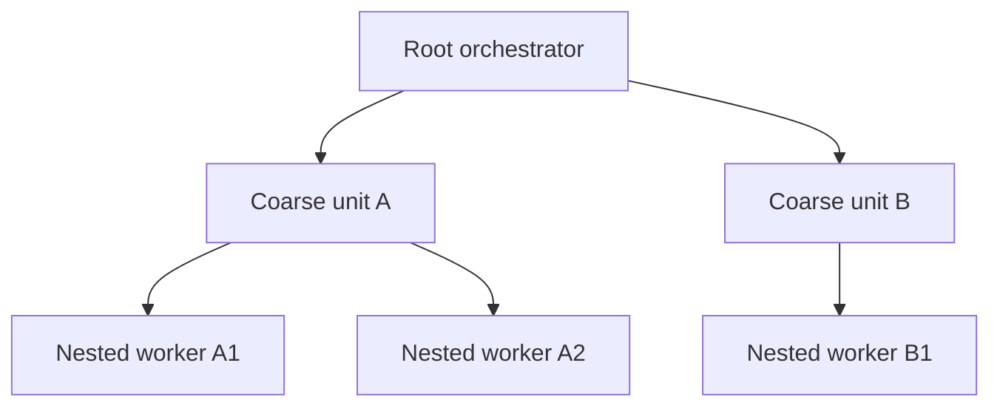

# choco-pi Dynamic Recursive Implementation

Use this workflow only when the user explicitly invokes `/task-dynamic` or names `task-dynamic`; never select it through automatic workflow routing. That invocation is the user's request for nested workers under the system rule that workers otherwise stay leaves. The regular `task` skill remains the default parallel workflow.

## 1. Bootstrap

Follow the `task` skill's bootstrap, including `check`, path-scoped instructions, `review_base`, the mutation lease through the same resolved script, and the acceptance ledger. The sections below define only this workflow's planning and execution deltas.

On invocation, the orchestrator uses `subagent_limits` to raise `maxSubagentDepth` to the depth the plan needs, up to `16`; it restores nothing afterward because runtime limits are session-scoped.

## 2. Decompose recursively

The orchestrator splits the objective into coarse units with exclusive direct and indirect write scopes. Any parent may recursively partition only its own scope among children; scopes narrow down the tree, preserving disjointness by construction. Each parent integrates and verifies its children's actual work before reporting up; a child report is not proof.

Choose roles by unit semantics and send every child a bounded task packet with objective, instructions, narrowed read/write scope, dependencies, done criteria, and verification. Name every spawned child by its goal (`role-goal`, one to three dashed words, unique among its siblings). Spawned children of a worker are that worker's responsibility; standard `Agent`, `steer_subagent`, `get_subagent_result`, and `stop_subagent` tools remain available.

## 3. Coordinate the tree

Every agent must read the per-turn `<system-reminder>`, which compares the scheduled top-level background count with the concurrency cap and also shows the whole-tree total and nesting depth whenever at least one subagent is active. When the scheduled count reaches the cap, finish work sequentially instead of queueing spawns. The root-only `subagent_limits` tool reads or sets session-scoped limits: `maxConcurrent` is unlimited at `0` with sanity cap `1024`, and `maxSubagentDepth` accepts `0`–`16`; adjust either only when the user instructs it.

Every agent may use `agent_message({ to, message, type? })`, addressing a recipient by unique alias such as `explorer-scout` (or `/root`). Delivery uses `<agent-message from="…" type="MESSAGE|TASK|FINAL">…</agent-message>`, where `from` is the sender's alias name (or `/root`); plain unwrapped conversation text is always the real user. Use `MESSAGE` for coordination, `TASK` only to request work from an agent you own, and `FINAL` for a result summary to the parent. A parent relays across branches when a decision needs orchestrator authority. User steering always outranks agent messages.

Optimize for the most correct and complete result rather than minimum tokens. Work solo only for trivial units, and verify adversarially before reporting up.

## 4. Integrate and hand off

Follow the `task` skill's sections 4–5 for integration, checkpointing, review, and handoff. The orchestrator owns final gates, commits through the harness `commit` skill, and mutation-lease release.
