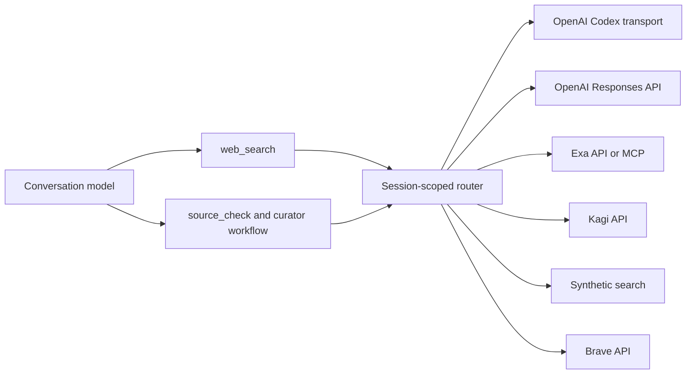

# Web search

choco-pi presents one model-facing `web_search` tool in an integrated profile. The conversation model does not select or authenticate the search service: an Anthropic, Synthetic, or other conversation can use an independently configured OpenAI, Exa, Kagi, Synthetic, or Brave search backend.

`web_search` is deferred, so use `tool_search` when it is not already visible. Page extraction and `agent_browser` remain separate tools for reading a result or interacting with a site.

## Architecture



The OpenAI Codex and OpenAI Responses routes are distinct transports in the same logical `openai` family. Results identify the backend and transport actually used. References returned by one session or transport cannot be reused in another.

## Provider selection and precedence

The request's `provider` field has the highest routing precedence. It accepts `auto`, `all`, one family, or a non-empty family list. The public families are `openai`, `exa`, `kagi`, `synthetic`, and `brave`. An explicit family array and `all` fan out across providers; `searchRouting.providers` is an ordered fallback sequence and does not fan out.

Without a request override, `web-search.json` can set either a fixed `searchProvider` (the legacy `provider` key is also accepted) or `searchRouting`. Setting both is an error. If neither is configured, automatic routing prefers families in this order:

1. OpenAI
2. Exa
3. Kagi
4. Synthetic
5. Brave

This conflict check is an intentional migration break. For a configuration that currently contains both `searchProvider`/`provider` and `searchRouting`, remove `searchRouting` to keep the old fixed provider, or remove the fixed provider key to use ordered routing.

Adapter availability, required request capabilities, and transport priority determine the actual attempt within that order. Synthetic search is never enabled automatically; its own extension setting and entitlement still apply.

The configuration file is `$PI_CODING_AGENT_DIR/web-search.json` when `PI_CODING_AGENT_DIR` is set, `$XDG_CONFIG_HOME/pi/web-search.json` when only `XDG_CONFIG_HOME` is set, and `~/.pi/web-search.json` otherwise. For example:

```json
{
  "searchRouting": {
    "providers": ["openai", "exa", "kagi"],
    "fallbackOn": ["transient", "network", "invalid-response"]
  },
  "allowBilledApiFallback": false
}
```

Each adapter resolves its own credentials from its package's supported Pi credential registry, configuration, environment, or proxy settings. A conversation-provider key is not forwarded to another provider. Provider-specific settings such as Brave locale, pagination, freshness, and safe-search or Exa search mode remain request constraints rather than hints.

Besides ordinary queries, the canonical tool supports image search and navigation actions when the selected transport advertises them. `open` accepts either a URL or a reference returned by the same session; `click` and `find` operate on a same-session reference, and `lineno` can select a location for transports that support it. Unsupported navigation capabilities fail rather than silently changing providers.

## Fallback, errors, and billing

Fallback is bounded by configured providers and deadlines. The core defaults to 120 seconds per attempt and 360 seconds total; backend-owned limits still apply, and callers of the core API can override either deadline explicitly. Missing credentials make an automatic candidate unavailable. Authentication, configuration, invalid-request, entitlement, cancellation, stale-session, and conflict errors stop routing. Empty but valid search results count as success. Quota fallback must be explicitly enabled and the adapter must mark the failure retryable.

A failed subscription transport does not fall through to a billed API transport later in the same sequential automatic or configured-routing invocation unless `allowBilledApiFallback` is `true`. The guard follows the resolved billing mode across provider families; an unavailable or unconfigured subscription does not activate it, and a free transport remains eligible. It does not disable an API-only provider selected as the first available route. A single explicit provider is a fresh selection, while an explicit provider array or `all` is intentional independent fanout, so one selected provider's subscription failure does not block another selected provider's API transport. Explicit provider selection never silently crosses to a different family.

Errors report attempted backends without including credentials. Cancellation stops the current transport and prevents another fallback attempt.

## Privacy and storage

Queries and enabled filters are sent to the selected backend. Page extraction may subsequently contact result URLs. Review each provider's privacy and billing terms before enabling it, and avoid putting secrets in queries.

Search results can be stored in the current Pi session so `get_search_content`, source checking, and curator workflows can retrieve them. Legacy stored provider results remain readable. Search references are session-owned and are not accepted across sessions.

## Standalone compatibility

The individual search packages retain their legacy tool behavior when loaded without the canonical core package. In the integrated profile, `choco-pi-web-search` must be followed immediately by `choco-pi-web-access`, before the other backend packages in `settings.json`. Canonical activation occurs only after the core requests integration and web-access actually registers `web_search`; a missing or disabled frontend therefore leaves legacy search tools available. Once activation succeeds, legacy names such as `web_run`, `web__run`, `synthetic_web_search`, and `agent_browser_web_search` are omitted from discovery and Code Mode in favor of `web_search`.

The profile's automated tests mock transport boundaries. They verify routing and credential isolation, not live provider entitlement, remote availability, result quality, or current pricing.
